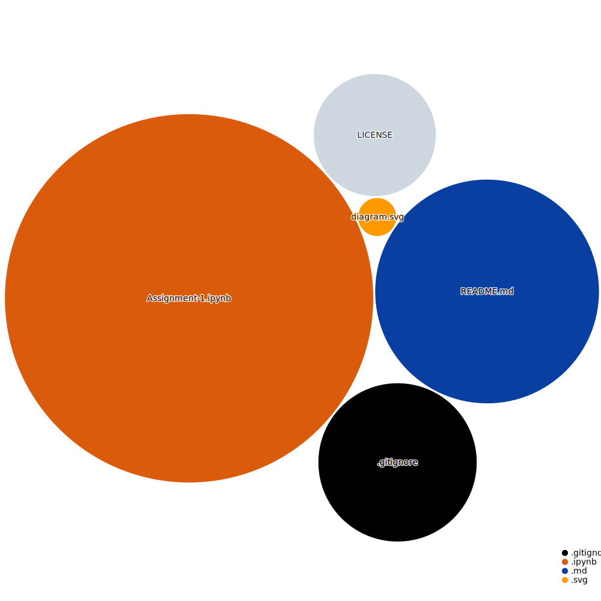

## Python Practice Exercises

This repository contains Python practice exercises in B.Financial Eng. in [ITESO](https://www.topuniversities.com/universities/iteso-universidad-jesuita-de-guadalajara).

 <i>Repository Tools:</i> 

##### Actions:  
##### Main Text-Editor:    
##### Language:  
##### Libraries:  
##### Interface:  
##### Version Control:    

##### License: 	

 <i>Contact:</i> 

  
   

   

[jancope](https://github.com/jancope)

 <i>Repository Visualization:</i> 

  
 

###### References:
[Journal of Banking & Finance 113-129](https://www.sciencedirect.com/science/article/abs/pii/0378426690900395#preview-section-references)

