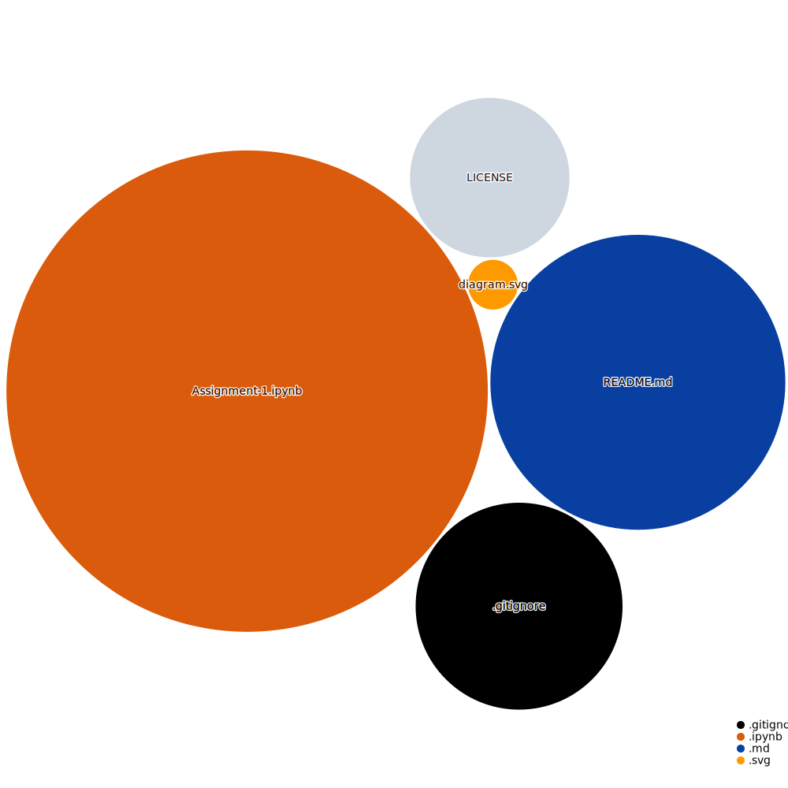

# **Simulation Processes**
## **1. Basic Exercises**  
---
### **Description**:
This repository contains the first assignment of the Simulation Processes course in [ITESO](https://www.topuniversities.com/universities/iteso-universidad-jesuita-de-guadalajara) B.Eng 
 *Graduation date:* *2017-2022 (9th semesters B.Eng).*

### **Objective:**
The objective of the assignment contained in this git repository is in fact very simple. 
*Practice Markdown & Python in teams with git.* 

##### **Diagram:**
The files in this repository are illustrated in the following diagram:

Instructions, source code and output is contained in the main notebook. 
[Assignment-1.ipynb](https://github.com/EstebanMqz/Basic-Ex./blob/main/Assignment-1.ipynb)

### **Contributors:** 
 &nbsp; [EstebanMqz](https://github.com/EstebanMqz) &nbsp; [Jancope](https://github.com/Jancope)

---
### **Tools:**
##### Github Action:&nbsp; 
##### Main Text-Editor:&nbsp;&nbsp; 
##### Language:&nbsp; 
##### Libraries:&nbsp; 
##### Web-Interface:&nbsp;&nbsp; 
##### Version Control:&nbsp;&nbsp; 
  

##### License:&nbsp; 
---
*Note:* This repository was modified for *presentation* purposes. 
[commit-history](https://github.com/EstebanMqz/Basic-Ex./commits/main) is found here. 

If you have any questions or comments, please feel free to send me a message here: 

  

### **References:**
A.G.Z. Kemna, A.C.F. Vorst, A pricing method for options based on average asset values. p. [113-129](https://www.sciencedirect.com/science/article/abs/pii/0378426690900395#preview-section-references)

